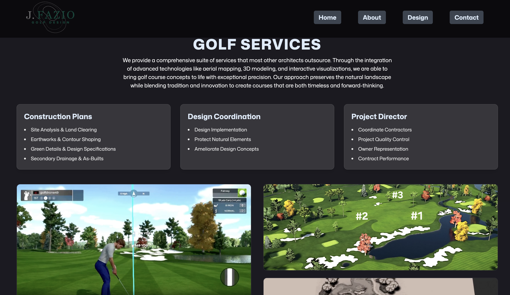
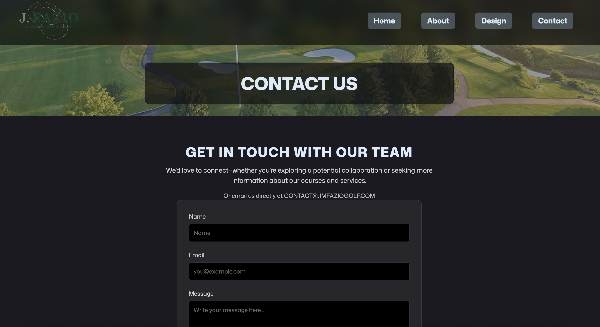

# ⛳ Jim Fazio Golf Website

Welcome to the official website project for **Jim Fazio Golf**, a modern, visually captivating online presence created to showcase the work and philosophy of acclaimed golf course architect Jim Fazio.

This project brings together the beauty of golf course design with immersive web technologies, offering visitors a rich experience exploring stunning visuals, in-depth design philosophy, and a portfolio of world-class golf courses. The site was built to create an immersive experience for the user, aimed at highliting Jim Fazio Golf's integration of timeless design and modern technology. 

Throughout the site, animations and displays such as interactive 3D-models (using **Three.js**) and slideshows are on full display.

---


---

## 🌟 Project Overview

Jim Fazio’s legacy in golf course architecture spans decades and continents. This website was designed to:

- Highlight Jim Fazio’s unique approach to course shaping, integrating modern technology with timeless design.
- Present high-quality images of his projects with a dynamic, responsive layout.
- Provide a platform for potential clients and enthusiasts to connect and learn more about his work.
- Engage each user, inviting them to interact with and immerse themselves in the site.

The site uses **React**, **Tailwind CSS**, and **Vite**, along with **GSAP** for engaging animations and **Three.js** for immersive, interactive 3D models.

---

## ✨ Features

✅ **Dynamic Hero Section** — A powerful, visually striking landing experience to capture attention immediately, implemented with an interactive 3D model and numerous animations.  
✅ **Responsive Design** — Layouts adapt fluidly to desktop, tablet, and mobile devices.  
✅ **Animated Elements** — Smooth scroll animations enhance the user experience.  
✅ **Photo Galleries** — Interactive slideshows display Jim Fazio’s most impressive golf course projects.  
✅ **Multi-Page Architecture** — Includes sections for design philosophy, featured courses, and contact details.  
✅ **SEO-Ready Structure** — Built with performance and discoverability in mind.

---

## 🖼️ Images from the Site

### 🔹 Hero Section


### 🔹 About Layout


### 🔹 Design Process Section


### 🔹 Contact Section


---

## 📥 Installation

1️⃣ **Clone the repository**
```bash
git clone https://github.com/yourusername/JimFazioGolf.git
cd JimFazioGolf

```

2️⃣ **Install dependencies**
```bash
npm install

```
3️⃣ **Run Development Server**
```bash
npm run dev

```

## 📝 Note
The site is still being reviewed and developed by myself and Mr. Fazio's team and has not yet been deployed.


